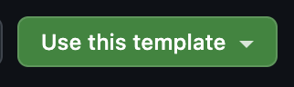

# KWK Scrollytelling template

This template is a starting point / example of how to create a scrollytelling piece using Svelte and Highcharts! 

## Recommended IDE Setup

[VS Code](https://code.visualstudio.com/) + [Svelte](https://marketplace.visualstudio.com/items?itemName=svelte.svelte-vscode).

## How to clone the repo
On this repo's homepage in GitHub, click the `Use this template` button. Select the option to create a new repository. This will create a new repo under your GitHub account.

Navigate to your new copy of this template in your GitHub profile. 

Clone your new repo locally and `cd` into it. 

Run `npm install` and then `npm run dev` to spin up the project locally. Then, start making changes! You can use this repo as a starting point for your own final project or simply as an example. 

## Credit
Repo created using vite (`npm create vite@6`)